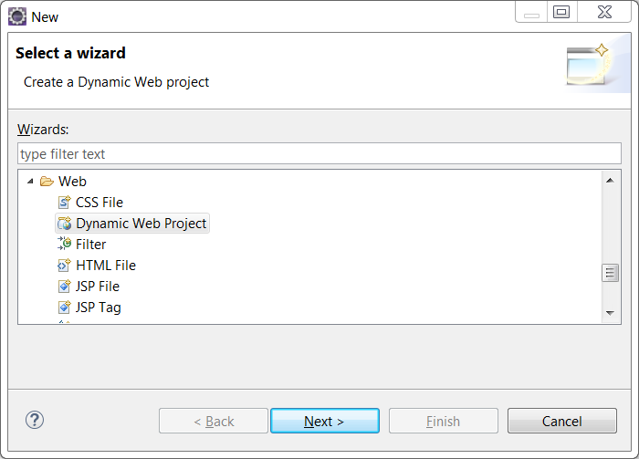

# 新建Web项目

### 启动Eclipse后,按Ctrl+N开启新建对话框,选择Web下的Dynamic Web Project,点击Next

### 在新建Web项目对话框中,输入项目名称nutzbook,web模块版本号选2.5,点击Next

### 新建源文件夹conf,修改默认class路径到WebContent/WEB-INF/classes,然后按Finish

### 完成图

请对比各种文件及文件夹是否正确.

## 手册关联(选修)

无