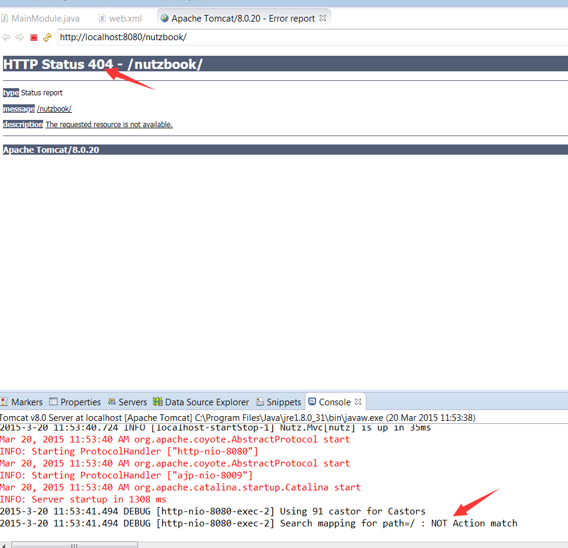

# 启动一下当前这个空的项目

按Alt+Shift+X,R 弹出对话框, 或者 右键项目--Run as--Run on Server

然后按Finish,开始启动, Windows下第一次启动会提示各种授权,全部勾上,yes啦

## 第一次启动会提示404页面,及没有匹配到任何方法,那是肯定的,呵呵

## 可能遇到的问题

* 提示某某类找不到, 一般是web.xml里面的NutFilter类名或MainModule类名写错,比较罕见的是jar没放好.
* 提示没有定义modules,检查web.xml里面的param-name属性的值是不是写了modules
* 只有极少日志, 大多是因为自行添加了log4j.jar,然后又没配置log4g,删掉log4j.jar即可.

## 确认日志里面的重要信息

检查点:

* A点 -- MainModule类正确显示, 一般能出来都不会出错
* B点 -- 编码信息,务必确保是UTF-8,如果不是,重新检查 [让Eclipse工作在UTF8环境](../prepare/eclipse_utf8.md)

其他日志,例如Iocby没找到,At没找到,因为的确没有配置,当前无需理会.

## 关掉Tomcat

在Servers选项页中,右键Tomcat8,然后stop.

## 手册关联(选修)

无