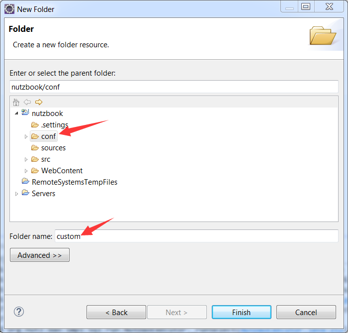
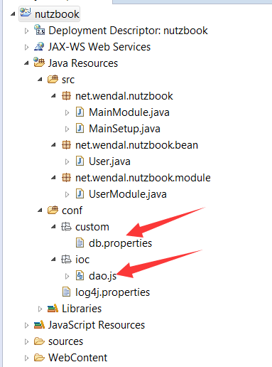

# 改进dao.js

## 之前的dao.js把数据库信息都写死在里面, 这一小节把它独立到一个配置文件中

## 首先,在conf这个源文件夹中,再建一个文件夹custom,代表用户自定义的配置



## 在custom文件夹中,建一个文件叫 db.properties


## 在db.properties中填入如下内容,即当前可配置的数据库信息

```ini
#mysql
db.url=jdbc:mysql://127.0.0.1:3306/nutzbook
db.username=root
db.password=root
#db.validationQuery=select 1
db.maxActive=100
db.testWhileIdle=true
db.filters=mergeStat
db.connectionProperties=druid.stat.slowSqlMillis=2000
#db.defaultAutoCommit=true

#oracle
#db.url=jdbc:oracle:thin:@//192.168.72.101:1521/xe
#db.username=system
#db.password=oracle
#db.validationQuery=select 1 from dual
#db.maxActive=100

#postgresql
#db.url=jdbc:postgresql://127.0.0.1:5432/nutzbook
#db.username=postgres
#db.password=root
#db.validationQuery=select 1
#db.maxActive=100
```

### druid参数简介

* filters是druid定义的一些过滤器,其中mergeStat是带合并的sql状态过滤
* connectionProperties配置中的2000代表如果sql执行超过2秒,就输出日志

提醒一下, Druid的SQL解析器遇到无法解析的SQL会报错,但不影响运行,若感觉不适,建议向druid提issue

或者将mergeStat改成stat也可以,只是统计SQL耗时的时候比较分散.

## 打开dao.js, 将其改造一下

```js
var ioc = {
		conf : {
			type : "org.nutz.ioc.impl.PropertiesProxy",
			fields : {
				paths : ["custom/"]
			}
		},
		dataSource : {
				factory : "$conf#make",
				args : ["com.alibaba.druid.pool.DruidDataSource", "db."],
				type : "com.alibaba.druid.pool.DruidDataSource",
				events : {
					create : "init",
						depose : 'close'
				}
		},
	  dao : {
	      type : "org.nutz.dao.impl.NutDao",
	    	args : [{refer:"dataSource"}]
	  }
};
```

### 可以看到, 新增了一个叫conf的bean, 而dataSource中的一些field改为从conf读取

## 再来个当前项目的一览图



## 检查无误后,启动tomcat,观察log, 可以看到加载了3个bean, 其中就包含刚刚定义的conf

```
2015-04-09 18:39:39,786 org.nutz.ioc.loader.json.JsonLoader.<init>(JsonLoader.java:44) DEBUG - loading ioc js config from [dao.js]
2015-04-09 18:39:39,791 org.nutz.ioc.loader.json.JsonLoader.<init>(JsonLoader.java:52) DEBUG - Loaded 3 bean define from path=[ioc/] --> [conf, dao, dataSource]
```
