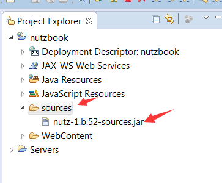

# 下载log4j和Nutz源码

本章需要2个jar包, log4j的jar及nutz的源码jar

## Nutz源码

* 有些人喜欢关联javadoc,但本书还是建议关联源码
* [下载地址](https://jfrog.nutz.cn/artifactory/jcenter/org/nutz/nutz/1.r.60/nutz-1.r.60-sources.jar)

## Log4j

* Java日志系统的事实标准
* 官网: http://logging.apache.org/log4j/1.2/
* 最新版是2.x系列,但咱们不用,用经典的1.2.x系列
* [下载地址](https://jfrog.nutz.cn/artifactory/jcenter/log4j/log4j/1.2.17/log4j-1.2.17.jar)

## 在nutzbook项目中建个文件夹叫sources,把nutz的源码包放进去



## maven配置

```xml
		<dependency>
			<groupId>log4j</groupId>
			<artifactId>log4j</artifactId>
			<version>1.2.17</version>
		</dependency>
```
