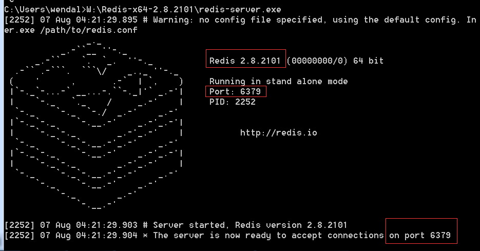

# 启动redis

## linux下

* 下载: http://download.redis.io/releases/redis-3.0.3.tar.gz
* 解压后make && make install
* 然后执行 redis-server 就启动完成了

## windows下

* windows下其实没有官方版本,只有微软自己fork的版本
* 下载地址: https://github.com/MSOpenTech/redis/releases
* 建议用 2.8系列,因为3.x还没完善
* 解压或安装后启动redis-server即可

## 启动截图

