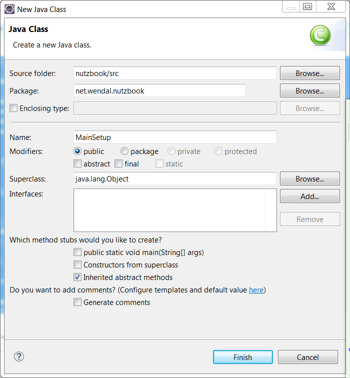

# 配置SetupBy

## 新建一个类叫MainSetup,package设置为net.wendal.nutzbook



## MainSetup需要实现Setup接口,并在其中初始化数据库表

```java
package net.wendal.nutzbook;

import org.nutz.dao.Dao;
import org.nutz.dao.util.Daos;
import org.nutz.ioc.Ioc;
import org.nutz.mvc.NutConfig;
import org.nutz.mvc.Setup;

public class MainSetup implements Setup {

    // 特别留意一下,是init方法,不是destroy方法!!!!!
	public void init(NutConfig nc) {
		Ioc ioc = nc.getIoc();
		Dao dao = ioc.get(Dao.class);
		// 如果没有createTablesInPackage,请检查nutz版本
		Daos.createTablesInPackage(dao, "net.wendal.nutzbook", false);
	}

	public void destroy(NutConfig nc) {
	}

}

```

## 打开MainModule类, 配置@SetupBy, 引用刚刚创建的MainSetup

```java
@SetupBy(value=MainSetup.class)
```

## 完成后的MainModule类


## 手册关联(选修)

* [SetupBy_-_应用启动以及关闭时的额外处理](http://nutzam.com/core/mvc/modules.html#@SetupBy_-_应用启动以及关闭时的额外处理)
