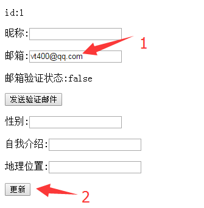
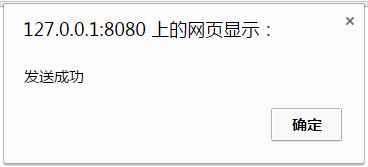

# 页面测试

## 启动Tomcat, 应无异常输出,然后访问首页,进行登录操作

```
http://127.0.0.1:8080/nutzbook/
```

## 登录完成后,访问如下地址,即可看到详情页

```
http://127.0.0.1:8080/nutzbook/user/profile/
```

## 输入有效的邮箱地址, 点击更新



## 点击"发送验证邮件",并观察后台日志输出



### 如果出错,检查输入的邮箱地址是否正确,且邮件服务器参数正常

## 打开邮箱,查看邮件


## 点击其中的链接, 应该提示"验证成功",如果是其他结果,检查日志输出的报错信息


## 回到用户详情页,刷新之,可以看到邮箱验证状态为true


## 可能遇到的问题

* 邮件发不了: 邮件服务器信息填错或目标邮箱填错