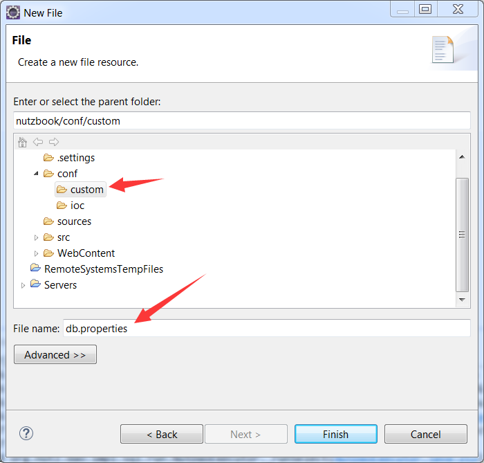

# 改进dao.js

## 之前的dao.js把数据库信息都写死在里面, 这一小节把它独立到一个配置文件中

## 首先,在conf这个源文件夹中,再建一个文件夹custom,代表用户自定义的配置


## 在custom文件夹中,建一个文件叫 db.properties



## 在db.properties中填入如下内容,即当前可配置的数据库信息

```ini
db.url=jdbc:mysql://127.0.0.1:3306/nutzbook
db.username=root
db.password=root
db.validationQuery=select 1
db.maxActive=100

```

## 打开dao.js, 将其改造一下

```js
var ioc = {
		conf : {
			type : "org.nutz.ioc.impl.PropertiesProxy",
			fields : {
				paths : ["custom/db.properties"]
			}
		},
	    dataSource : {
	        type : "com.alibaba.druid.pool.DruidDataSource",
	        events : {
	        	create : "init",
	            depose : 'close'
	        },
	        fields : {
	            url : {java:"$conf.get('db.url')"},
	            username : {java:"$conf.get('db.username')"},
	            password : {java:"$conf.get('db.password')"},
	            testWhileIdle : true,
	            validationQuery : {java:"$conf.get('db.validationQuery')"},
	            maxActive : {java:"$conf.get('db.maxActive')"},
	        }
	    },
	    dao : {
	    	type : "org.nutz.dao.impl.NutDao",
	    	args : [{refer:"dataSource"}]
	    }
};
```

### 可以看到, 新增了一个叫conf的bean, 而dataSource中的一些field改为从conf读取

## 再来个当前项目的一览图


## 检查无误后,启动tomcat,观察log, 可以看到加载了3个bean, 其中就包含刚刚定义的conf

```
2015-04-09 18:39:39,786 org.nutz.ioc.loader.json.JsonLoader.<init>(JsonLoader.java:44) DEBUG - loading ioc js config from [dao.js]
2015-04-09 18:39:39,791 org.nutz.ioc.loader.json.JsonLoader.<init>(JsonLoader.java:52) DEBUG - Loaded 3 bean define from path=[ioc/] --> [conf, dao, dataSource]
```