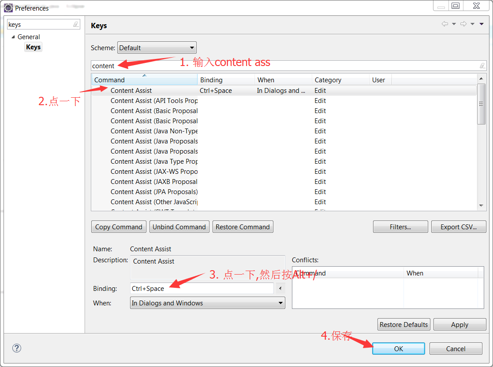

# Eclipse的自动完成

换个说法就是Alt+/的自动提示

编写这本书的时候发现新版的Eclipse的默认设置又改了,那我们只能自行改一下咯

### 在Eclipse界面中,按菜单中的Windows-->Perferences,输入keys, 然后输出word com,注意空格, 然后点一下唯一一条记录, 再按下Unbind Command.

### 然后修改Content Assist的绑定. 输入content ass,第一条记录,点一下Binding的输入框,删掉老内容,按下Alt+/,保存

