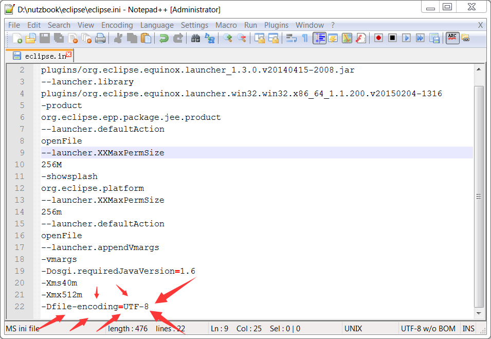

# 让Eclipse工作在UTF-8环境下

## 非常非常重要

当前最通用的编码UTF-8,同时也避免一堆乱码问题. 本教程一概使用UTF-8编码.

### 用 Notepad++或其他非记事本的文本编辑器,打开nutzbook/eclipse/eclipse.ini文件

在末尾加入一句

    -Dfile-encoding=UTF-8

### 效果如下

### 保存并重启Eclipse